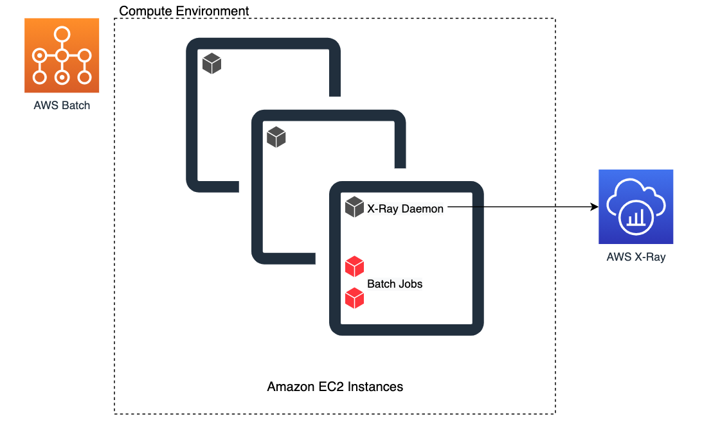
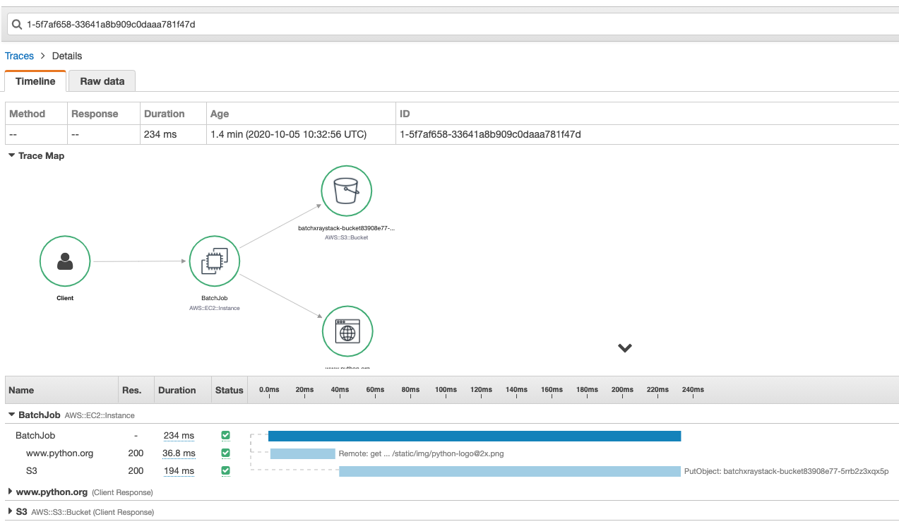

# How to configure AWS X-Ray tracing for your AWS Batch jobs?


# Architecture


# Steps

1. Install dependencies: `npm install`

2. Bootstarp CDK on desired region: `cdk bootstrap aws://AWS_ACCOUNT_ID/AWS_REGION`

3. Deploy the Stack: `cdk deploy BatchXrayStack`

4. Run the Batch Job: 

```bash
JOB_DEFINITION=$(aws cloudformation describe-stacks --stack-name BatchXrayStack --query "Stacks[*].Outputs[?ExportName=='JobDefinitionArn'].OutputValue" --output text)
JOB_QUEUE=$(aws cloudformation describe-stacks --stack-name BatchXrayStack --query "Stacks[*].Outputs[?ExportName=='JobQueueArn'].OutputValue" --output text)
aws batch submit-job --job-name batch-xray --job-queue $JOB_QUEUE  --job-definition $JOB_DEFINITION
```

After job is complete, a similar X-Ray trace should appear on the X-Ray console:



5. Clean up resources:

```bash
BUCKET=$(aws cloudformation describe-stacks --stack-name BatchXrayStack --query "Stacks[*].Outputs[?ExportName=='BucketForBatchJob'].OutputValue" --output text)

# Empty bucket with images uploaded by Batch Job
aws s3 rm s3://$BUCKET --recursive

# Delete CDK stack
cdk destroy BatchXrayStack

# Delete CDK bootstrap stack
aws cloudformation delete-stack --stack-name CDKToolkit
```
